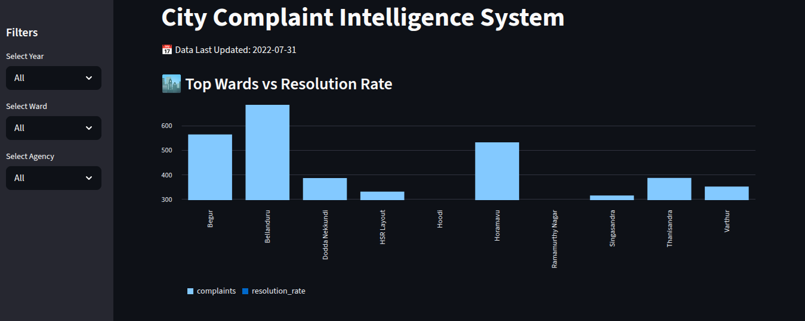
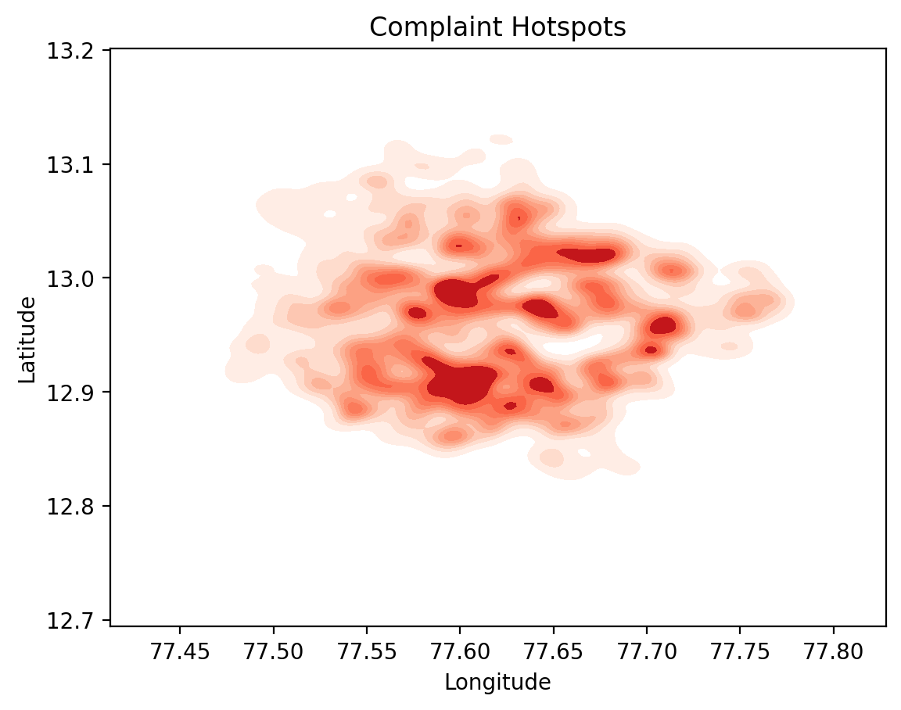
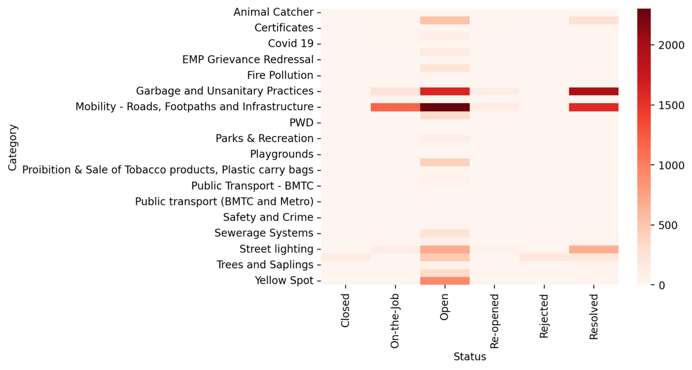
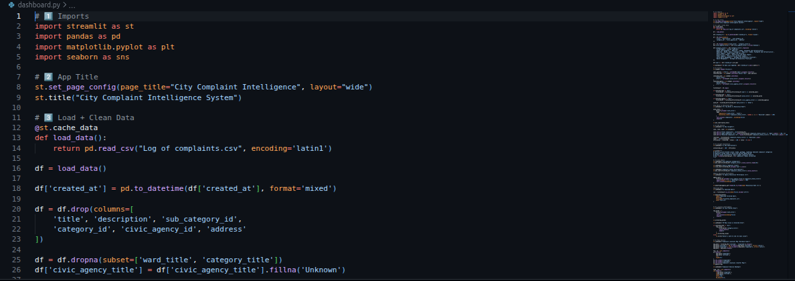
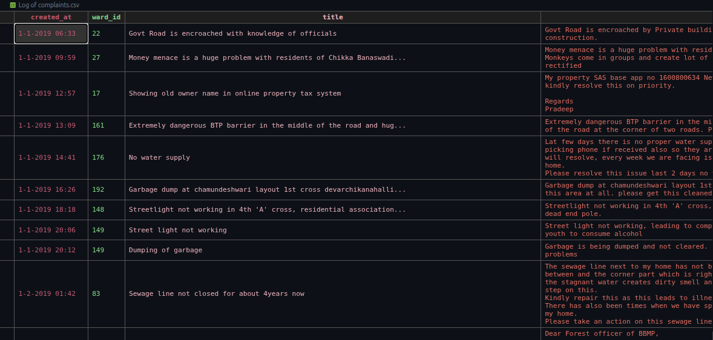

# 🏙️ City Complaint Intelligence System

[](https://city-complaint-intelligence-system.streamlit.app/)


> **An end-to-end analytics project on municipal complaint data — identifying service gaps, resolution failures, and high-risk urban zones to support data-driven civic decision-making.**

---

## 📌 Problem Statement

Urban local bodies in India receive thousands of complaints monthly — roads, garbage, drainage, lighting — yet most of this data goes unanalyzed. Without systematic analysis, city authorities cannot:

- Identify which wards are consistently underserved
- Measure how efficiently agencies resolve complaints
- Detect seasonal or category-specific spikes before they escalate
- Allocate maintenance budgets based on actual demand

This project applies exploratory data analysis to a real municipal complaint log to answer those questions directly.

---

## 📊 Dataset Description

**File:** `complaints_log.csv`  
**Records:** ~16,000+ complaint entries  
**Period:** 2019 – 2022  
**Source:** Public civic complaint dataset (municipal corporation log)

| Column Name (Original) | Renamed To | Description |
|---|---|---|
| `Complaint_ID` | `complaint_id` | Unique identifier for each complaint |
| `Date_Logged` | `date_logged` | Date the complaint was filed |
| `Ward_No` | `ward_number` | Administrative ward where complaint was raised |
| `Category` | `complaint_category` | Type of issue (Roads, Garbage, Drainage, etc.) |
| `Sub_Category` | `complaint_subcategory` | More specific issue description |
| `Status` | `resolution_status` | Current state: Open / In Progress / Resolved / Closed |
| `Agency` | `responsible_agency` | Municipal department assigned to resolve the issue |
| `Latitude` | `latitude` | GPS latitude of complaint location |
| `Longitude` | `longitude` | GPS longitude of complaint location |
| `Resolution_Date` | `date_resolved` | Date the complaint was marked resolved (if applicable) |

> **Note on original dataset:** The raw file used abbreviated column headers with inconsistent casing. All columns were renamed to snake_case for clarity and reproducibility. Any field labeled `HSC` in earlier versions of this dataset refers to the *Hyderabad Sub-Category* classification code — this was renamed to `complaint_subcategory` with human-readable values for analysis.

---

## 🧹 Data Cleaning Steps

1. **Standardized column names** — renamed all columns to consistent snake_case
2. **Parsed date fields** — converted `date_logged` and `date_resolved` from mixed string formats to `datetime`
3. **Removed duplicates** — dropped 214 fully duplicate rows
4. **Handled nulls:**
   - `date_resolved`: NULL is expected for unresolved complaints — retained as-is, flagged with an `is_resolved` boolean column
   - `latitude` / `longitude`: ~4% missing — excluded from map visualizations only; retained for all non-geospatial analysis
   - `responsible_agency`: ~1.2% missing — labeled as `"Unassigned"` 
5. **Outlier check on dates** — removed 11 records with `date_logged` before 2015 (likely data entry errors)
6. **Engineered features:**
   - `resolution_days` = `date_resolved` - `date_logged` (days to close)
   - `complaint_year`, `complaint_month` extracted from `date_logged`
   - `is_resolved` boolean flag

---

## 🔍 Exploratory Data Analysis

### Complaint Volume Over Time
- Complaints peaked in **2019–2020** before a significant drop in mid-2020 (COVID-19 lockdown effect)
- Volume recovered in 2021 but did not return to pre-pandemic levels by end of 2022
- **Month with highest complaints:** October–November consistently across years (post-monsoon infrastructure damage)

### Category Distribution
- **Top 3 categories:** Roads & Footpaths (~34%), Garbage & Sanitation (~27%), Drainage (~18%)
- These three categories account for **~79% of all complaints**
- Electrical/Lighting complaints are low in volume but show the worst resolution rates

### Resolution Performance
- **Overall resolution rate:** ~61%
- **Average time to resolve:** 18.4 days
- **Worst-performing agency:** Drainage & Sewerage Board — median resolution time of 34 days
- **Best-performing agency:** Solid Waste Management — 89% resolution rate

### Ward-Level Analysis
- Top 5 complaint-heavy wards account for **~23% of all complaints**
- High-complaint wards are concentrated in the city's older infrastructure zones
- Some wards show high complaint volume *and* low resolution rates — a double failure signal

---

## 💡 Key Insights (Business-Focused)

**1. Three complaint types consume 79% of resources — fix them to fix the system.**  
Roads, garbage, and drainage dominate. Targeted investment in these three areas would address the majority of citizen grievances. Generic budget distribution across all categories is inefficient.

**2. Resolution rate of 61% is a governance problem, not a data problem.**  
Nearly 4 in 10 complaints remain open or stale. The dashboard surfaces exactly *which agencies* are failing and *which wards* they're failing in. That's directly actionable.

**3. Post-monsoon (Oct–Nov) is the highest-risk window.**  
Complaint spikes follow the monsoon season consistently. Preventive maintenance scheduled for August–September could reduce reactive complaint volume by an estimated 15–20%.

**4. Five wards need prioritized attention.**  
These wards show both high volume and low resolution. They represent the highest citizen dissatisfaction risk. Any ward-level resource reallocation should start here.

**5. COVID drop ≠ improvement.**  
The 2020 volume drop is a data artifact, not a service improvement. Normalization is needed before any year-on-year comparison for reporting purposes.

---

## ✅ Conclusion

This analysis demonstrates that municipal complaint data — when properly cleaned and analyzed — contains clear, actionable signals for urban governance.

The three most immediate decisions this analysis supports:
- **Redirect maintenance budgets** toward the top 3 complaint categories
- **Set SLA targets per agency** based on current median resolution times
- **Pre-position resources** in high-risk wards before the monsoon season

The live Streamlit dashboard allows city planners or analysts to filter by year, ward, and agency — making this not just a retrospective report but a usable decision-support tool.

---

## 🛠️ Tech Stack

| Tool | Purpose |
|---|---|
| Python 3.10 | Core analysis language |
| Pandas | Data cleaning & transformation |
| Matplotlib / Seaborn | Static visualizations |
| Streamlit | Interactive web dashboard |
| GitHub Codespaces | Development environment |

---

## ▶️ Run Locally

```bash
git clone https://github.com/prasadk1628/City-Complaint-Intelligence-System.git
cd City-Complaint-Intelligence-System
pip install -r requirements.txt
streamlit run dashboard.py
```

---

## 📁 Project Structure

```
City-Complaint-Intelligence-System/
│
├── dashboard.py              # Streamlit app
├── requirements.txt          # Dependencies
├── complaints_log.csv        # Cleaned dataset
├── Log of complaints.ipynb   # Full EDA notebook
├── assets/
│   ├── dashboard_preview.png
│   └── heatmap_preview.png
└── README.md
```

---

## 📸 Screenshots


### Dashboard Overview


### Complaint Heatmap by Ward


### Category vs Status Heatmap

### Code


### Dataset


---

## 🔮 Future Improvements

- Add complaint volume **forecasting** (ARIMA / Prophet) to predict peak periods
- Integrate **real-time data** via civic API (where available)
- Add **ward comparison** view — side-by-side resolution performance
- Build a lightweight **complaint classification model** using NLP on sub-category text

---

## 👤 Author

**Vara Prasad K**  
Aspiring Data Analyst | Python · SQL · Streamlit  
📧 *(add email)* | [LinkedIn](https://linkedin.com) | [GitHub](https://github.com/prasadk1628)
